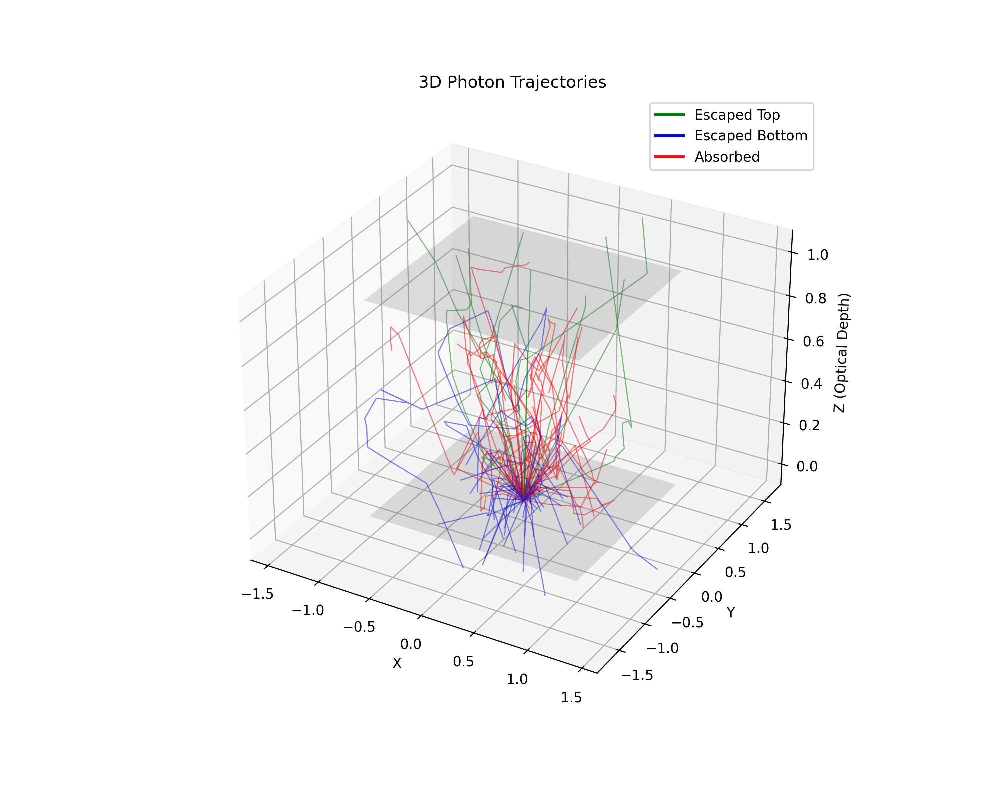
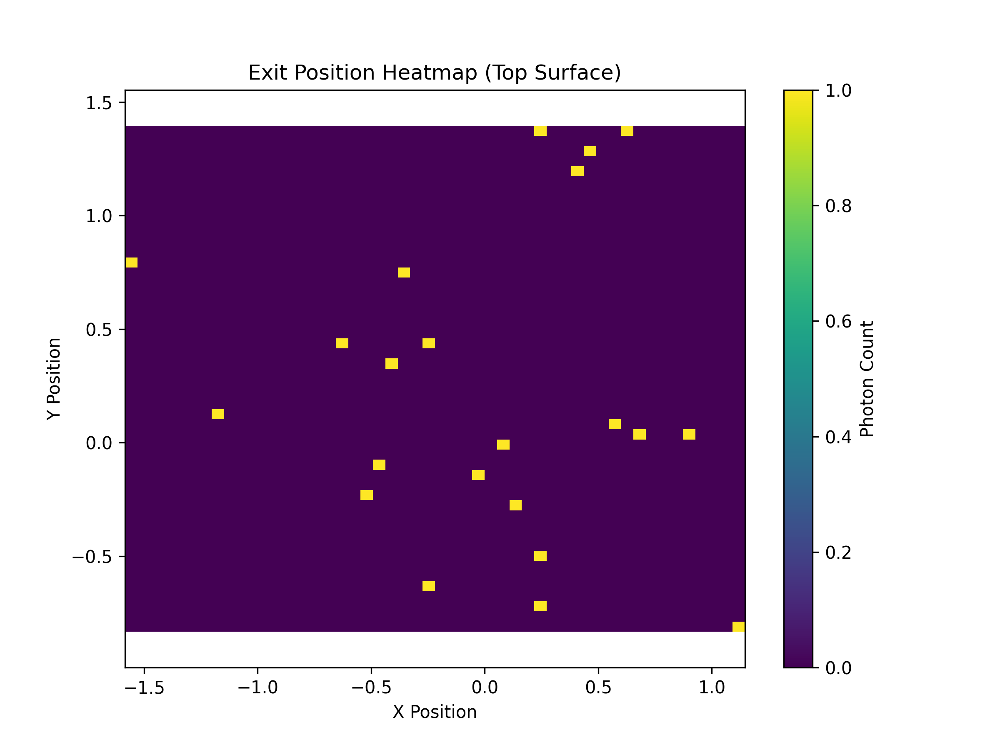
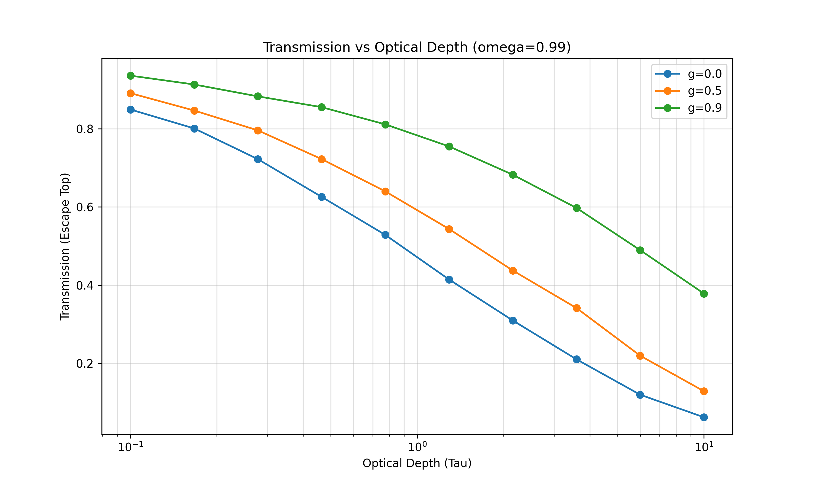
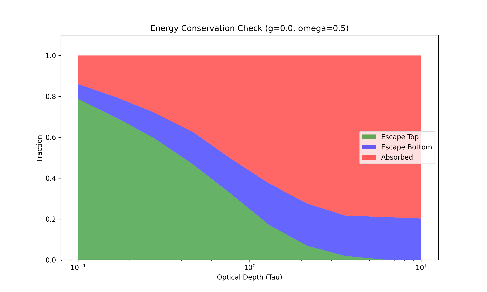
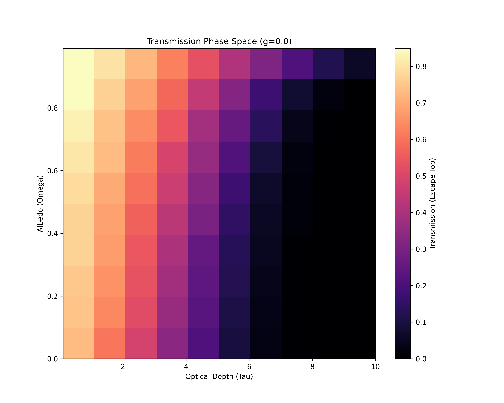

# 3D Monte Carlo Simulation Visualizations

This document presents the visualizations generated from the 3D photon transport simulation. These plots help in understanding the physical behavior of light as it interacts with a scattering medium.

## 1. 3D Photon Trajectories
**File:** `plot_3d_trajectories.png`

This plot visualizes the random walk of individual photons.
- **Green Lines**: Photons that transmitted through the slab (escaped top).
- **Blue Lines**: Photons that reflected back (escaped bottom).
- **Red Lines**: Photons that were absorbed.
- **Gray Planes**: The boundaries of the slab at $z=0$ and $z=1$.

---

## 2. Exit Position Heatmap
**File:** `plot_exit_heatmap.png`

This heatmap shows the spatial distribution of photons exiting the top surface.
- The source is a point source at $(0,0,0)$.
- The spread of photons indicates the "blurring" effect of the scattering medium.
- Brighter colors (yellow/green) indicate higher photon density.

---

## 3. Transmission vs. Optical Depth
**File:** `plot_transmission_vs_tau.png`

This chart shows how much light gets through the slab as it becomes optically thicker.
- **X-Axis**: Optical Depth ($\tau$). Higher values mean a thicker or denser medium.
- **Y-Axis**: Transmission Fraction.
- **Trends**:
    - Transmission drops exponentially as $\tau$ increases.
    - **Forward Scattering ($g=0.9$)**: Much higher transmission than isotropic scattering ($g=0$) because photons are pushed forward.

---

## 4. Energy Conservation Check
**File:** `plot_energy_conservation.png`

This stacked area chart verifies that the simulation conserves energy.
- The sum of **Transmission** (Green), **Reflection** (Blue), and **Absorption** (Red) should always equal 1.0.
- This plot confirms that no photons are "lost" in the simulation logic.

---

## 5. Albedo Impact Heatmap
**File:** `plot_albedo_impact_heatmap.png`

This heatmap visualizes the "Phase Space" of the simulation.
- **X-Axis**: Optical Depth ($\tau$).
- **Y-Axis**: Single Scattering Albedo ($\omega$).
- **Color**: Transmission Fraction.
- **Insight**:
    - High $\omega$ (top rows): Scattering dominates, light can penetrate deeper.
    - Low $\omega$ (bottom rows): Absorption dominates, transmission drops to zero quickly.

